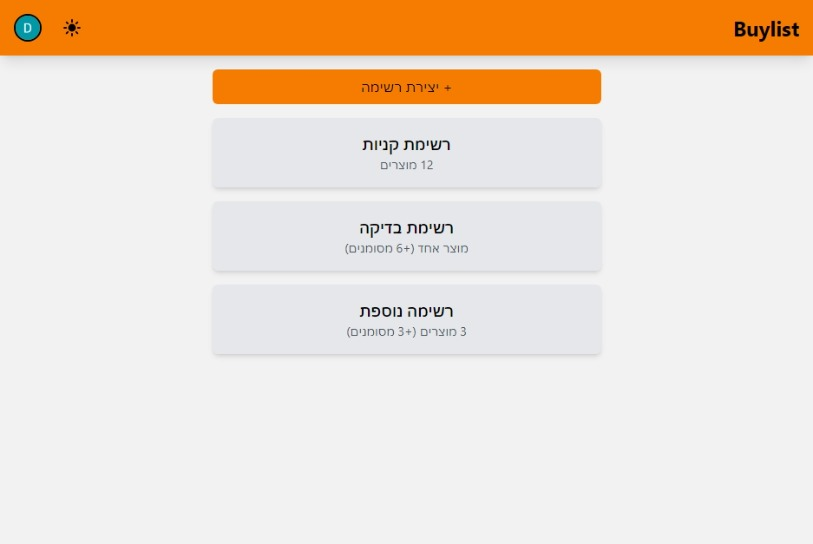
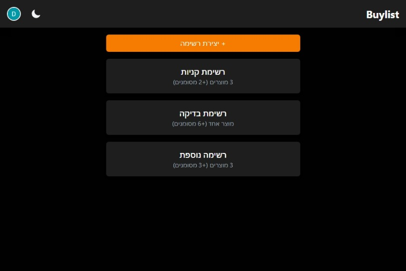
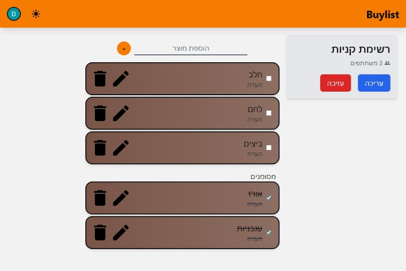
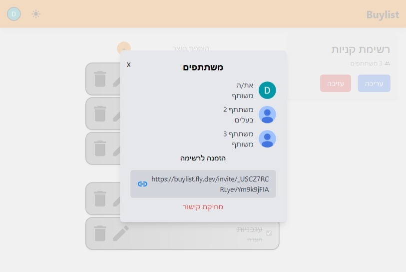
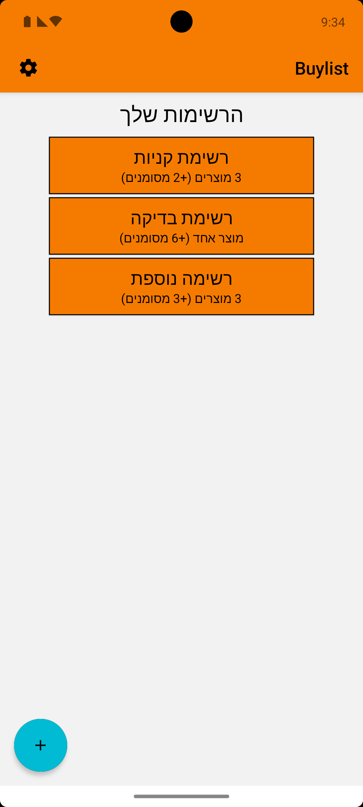
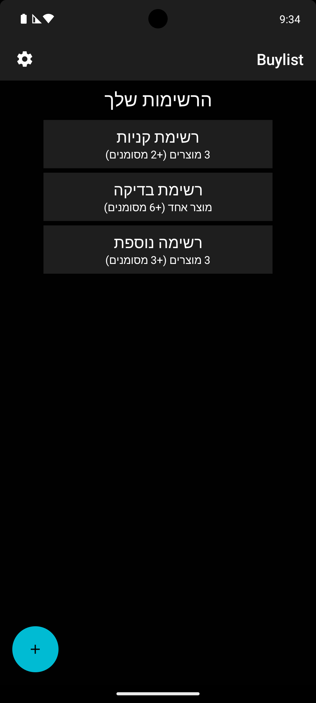
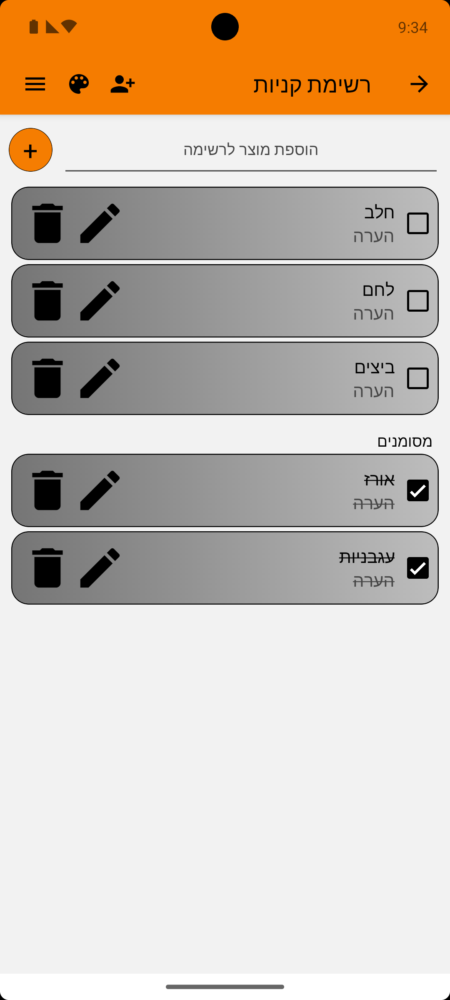

# Buylist

A collaborative shopping list app that allows users to create and share lists with others in real time. Available on both web and mobile, the app supports offline functionality, list customization, and Google authentication.

## Features

### General
- Create, edit, and delete shopping lists.
- Customize lists with different colors.
- Add, edit, delete, and check/uncheck products.
- Prevent duplicate products, with an option to add anyway or uncheck an existing item.
- Invite others to collaborate using an invite link (expires after 3 days).
- View and manage participants (owner can remove participants).
- Dark mode and light mode support.
- Google authentication for secure login.
- Real-time updates using WebSockets.

### Web Version
- Built using React, Vite, and TailwindCSS.
- Uses React Router for navigation.

### Mobile Version
- Built with Expo and React Native.
- Uses Expo Router for navigation.
- Supports offline-first functionality:
  - View all lists, including shared ones, while offline.
  - Perform operations like adding, editing, or deleting products, which sync when online.
- Allows creation of local "personal" lists that are not synced with the server.
- Local lists can be shared and converted into shared lists.
- Designed for Android (not tested on iOS).

## Try It Out
Buylist is available on multiple platforms:

- **Web Version:** Access the app from any browser at [Live Website](<https://buylistapp.web.app>).
- **Android Version:** Download the app from the [Google Play Store](<https://play.google.com/store/apps/details?id=com.shalev.shoppinglistmobile>).

The mobile version includes additional features such as offline support and local lists. Note that the app is currently designed and tested for Android, and iOS support has not been tested.

## Screenshots

### Web Version





### Mobile Version
  

## Technologies Used

### Clients (Web & Mobile)
- **React, React Native, Vite, Expo** (frontend frameworks)
- **TailwindCSS** (for styling)
- **TanStack Query** (for API queries and mutations)
- **TanStack Query Persist** (for offline-first sync on mobile)
- **Firebase Authentication** (for authentication)
- **Socket.IO** (for real-time updates)
- **AsyncStorage** (for local lists on mobile)

### Server
- **Node.js, Express** (backend framework)
- **PostgreSQL, Prisma** (database and ORM)
- **Redis** (for Socket.IO adapter communication between instances)
- **Morgan, Winston** (for logging)
- **Zod** (for validation)
- **Mocha, Chai, Sinon, Supertest** (for testing)
- **Socket.IO** (for real-time communication)

## Environment Variables
Each part of the application requires a `.env` file in its root folder.

### Web Client
```
VITE_SERVER_URL=<server_url>
VITE_FIREBASE_API_KEY=<firebase_api_key>
VITE_FIREBASE_AUTH_DOMAIN=<firebase_auth_domain>
VITE_FIREBASE_PROJECT_ID=<firebase_project_id>
VITE_FIREBASE_MESSAGING_SENDER_ID=<firebase_messaging_sender_id>
VITE_FIREBASE_APP_ID=<firebase_app_id>
```

### Mobile Client
```
EXPO_PUBLIC_GOOGLE_WEB_CLIENT_ID=<google_signin_client_id>
EXPO_PUBLIC_SERVER_URL=<server_url>
GOOGLE_SERVICES_JSON=google-services.json (file required)
ANDROID_PACKAGE=<android_package_name>
```

### Server
```
NODE_ENV=<development_or_production> (optional)
PORT=<server_port> (optional, default value provided)
DATABASE_URL=<postgres_database_url>
REDIS_URL=<redis_url> (optional, default value provided. A Redis database is required)
GOOGLE_APPLICATION_CREDENTIALS=service-account-file.json (file required)
CLIENT_URL=<client_url> (optional, defaults to localhost:5173, used for cors and redirects)
SERVER_URL=<server_url> (optional, used for logging)
GOOGLE_API_KEY=<google_api_key> (optional, required for testing)
FIREBASE_AUTH_EMULATOR_HOST=127.0.0.1:9099 (optional, required for testing)
```
> **Note:** To properly run tests in development, a Firebase Auth Emulator is required along with `GOOGLE_API_KEY`.
